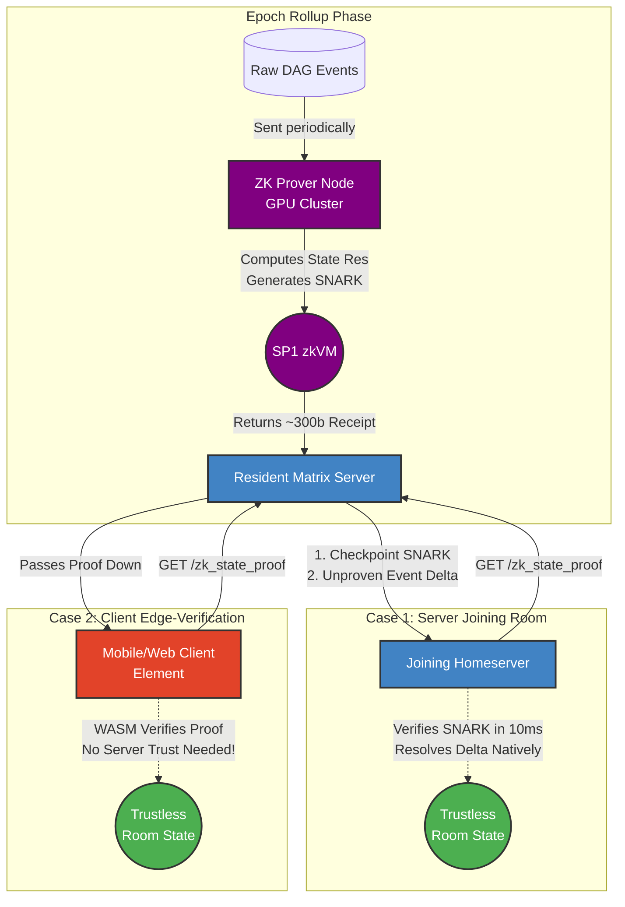

# ZK-Matrix-Join: Trustless Matrix Light Clients

[](#) [](#) [](#)

A Layer-2 Zero-Knowledge scaling solution for the Matrix protocol.

We're replacing slow **Full Joins** and insecure **Partial Joins** with instant, cryptographically secure **ZK-Joins**.

## The Problem

Joining a massive Matrix room (like `#matrix:matrix.org`) sucks. You either:

1. **Download the universe (Full Join):** Crunch hundreds of thousands of events from genesis. Kills your RAM, CPU, and takes forever.
2. **YOLO it (MSC3902):** Blindly trust the remote server's state so you can chat now, verifying gigabytes in the background. A huge compromise on decentralization.

## The Solution: Math > Computation

`zk-matrix-join` moves Matrix state resolution into a Zero-Knowledge architecture.

A beefy prover node crunches the heavy State Res v2 logic inside a Gen-Purpose **zkVM** (SP1). It generates a succinct STARK proof proving the state conforms perfectly to protocol rules.

Instead of downloading 50MB of Auth Chain and verifying 500k signatures, servers (and browser light clients) just download the 2MB state and a tiny 250KB proof. They verify it in **milliseconds**.

Instant, 100% trustless joins.

## Architecture



Built on the **SP1 RISC-V zkVM**, allowing native Rust libraries (`ruma-state-res`) to run in ZK.

- **`src/host/` (The Prover):** Orchestrates state res, pre-sorts DAG branches, and builds linear "Hints" for the guest. Compresses the SP1 STARK into a tiny Groth16 SNARK.
- **`src/guest/` (The zkVM):** Linearly verifies the Host's Hints in $O(N)$ time (avoiding expensive $O(N \log N)$ sorting in the VM) using optimized memory hashing.
- **`src/wasm-client/` (The Verifier):** Exposes SNARK verification to pure JavaScript via WebAssembly, clocking <15ms verification times in the browser.

## API Specification

We propose new endpoints to securely retrieve these ZK rollups.

### 1. Server-to-Server (Federation API)
When a Matrix homeserver joins a room, it requests the proof from a resident server.

**Request:**
```http
GET /_matrix/federation/unstable/org.matrix.msc0000/zk_state_proof/!room:example.com
Authorization: X-Matrix origin="joining.server",key="...",sig="..."
```

### 2. Client-to-Server (Client-Server API)
The homeserver generously passes this exact proof down to end-user clients (Element, etc.) so they can perform edge-verification. The client requests the proof to verify the state trustlessly.

**Request:**
```http
GET /_matrix/client/unstable/org.matrix.msc0000/rooms/!room:example.com/zk_state_proof
Authorization: Bearer <access_token>
```

**Example Response (Both Endpoints):**
```json
{
  "room_version": "12",
  "checkpoint": {
    "event_id": "$historic_cutoff",
    "resolved_state_root_hash": "<sha256_hash>",
    "zk_proof": "<base64_groth16_snark>",
    "image_id": "<sp1_vkey_hash>"
  },
  "delta": {
    "recent_state_events": [ ... ]
  }
}
```

## How It Works: The Proof, Journal, and Receipt

What does "verifying the proof" actually mean in practice?

- **The Proof:** A highly compressed, `~300 byte` cryptographic object (Groth16 or Plonk SNARK) that mathematically represents correct program execution without revealing the inner steps.
- **The Journal:** The public inputs/outputs. For Matrix joins, this strictly contains the starting room state hash and the final resolved state hash.
- **The Receipt:** The bundle comprising the Journal, the `image_id` (the hash of the exact program/rules that were run), and the SNARK proof.

When you verify the receipt, you are cryptographically asserting: *"I see mathematical proof that running this specific Matrix Ruleset program (`image_id`) on starting state `A` deterministically resulted in end state `B`."*

## Epoch Rollups & Prover Interaction

To prevent prohibitive CPU load, homeservers do not generate ZK proofs synchronously during a join. Instead, they generate **Epoch Rollups** asynchronously.

- **The ZK Server (Prover Node):** Generating a STARK proof requires massive computational power (often utilizing GPU clusters). Standard Matrix homeservers (like Synapse) do not do this themselves. Instead, they delegate the heavy lifting to a specialized external ZK Prover over an internal API/queue. The homeserver feeds the raw Matrix events to the Prover, and the Prover eventually returns the completed `~300 byte` receipt.
- **Frequency:** Provers compute a new rollup periodically (e.g., bi-weekly or every 10,000 events).
- **Determinism:** They take the agreed-upon state from the *last* epoch, process the large DAG delta, and produce a new checkpoint `resolved_state_root_hash`. Because Matrix State Resolution (v2) is strictly deterministic, multiple nodes will calculate the identical state.
- **Hybrid Verification:** When a node joins, it mathematically verifies the massive historic epoch in milliseconds using the Checkpoint SNARK. It then only performs native State Resolution on the tiny unproven event `delta` (the few events that happened since the last epoch cutoff).

## Is it truly "Zero Knowledge"?

Yes and no.

In cryptography, "Zero Knowledge" means proving a statement without revealing the underlying data. In this architecture, we primarily leverage the **succinctness** (the "S" in SNARK) and **verifiable computation** aspects, rather than strict privacy (the "ZK").

We *are* generating a proof that we executed Matrix rules over millions of events without forcing the verifier to download or see those events. The intermediate state transformations remain hidden from the final proof—fulfilling a technical definition of ZK computation.

However, Matrix room states are generally public to the servers inside them. We are not hiding the final output state (which you need to chat anyway); we are using ZK math to mathematically compress computation and skip the downloading of historical data.

## UX & Customer Basics

How does this directly benefit an end-user joining a room?

- **Instant Joins:** Tapping "Join Room" for giant rooms like `#matrix:matrix.org` goes from a multi-minute loading spinner to under `100ms`. You are instantly in the chat, and the room state is instantly trustless.
- **True Decentralization for Light Clients:** Mobile phones and web browsers (via WebAssembly) can independently verify the room state themselves. They no longer have to blindly trust that their chosen homeserver isn't lying to them about the room's members or power levels.
- **Battery & Bandwidth:** A mobile client only downloads a 300-byte receipt and the current state delta, instead of gigabytes of historical event DAGs. This preserves mobile data limits and battery life.
- **Seamless Upgrade:** Users don't need to know what a "SNARK" is. The UX is identical to standard Matrix, just orders of magnitude faster and uncompromisingly secure.

## Get Started

Highly experimental. We're using the SP1 Prover paired with Verifiable Computation to scale Matrix topology resolution to 1,000,000+ events.

To run the simulated validations natively in Rust (without burning CPU on full SNARK generation):

```bash
cargo test
```

## License

Dual-licensed under MIT or Apache 2.0.
