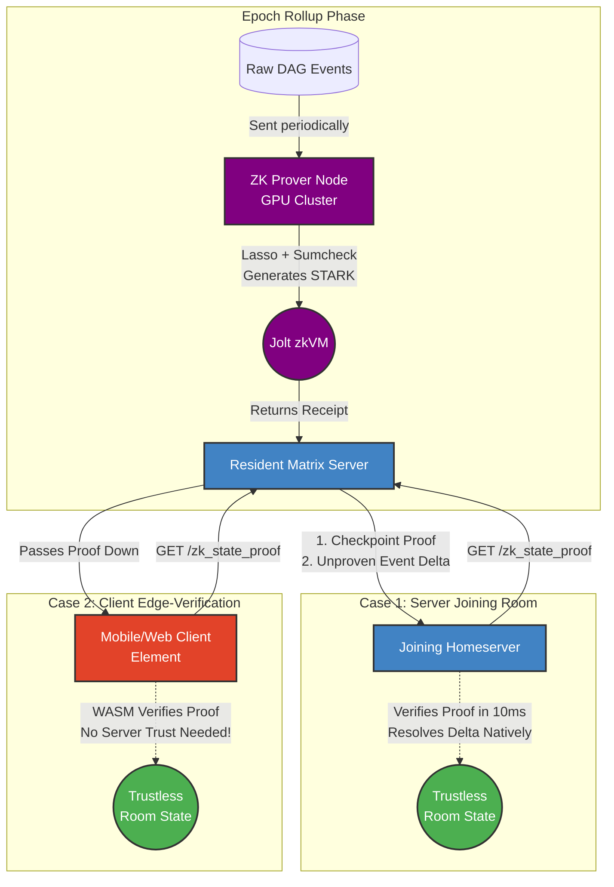

# ZK-Matrix-Join: Trustless Matrix Light Clients

[](https://github.com/gamesguru/ruma-zk/actions/workflows/ci.yml) [](#) [](#) [](#)

A Layer-2 Zero-Knowledge scaling solution for the Matrix protocol powered by **a16z's Jolt VM**.

We're replacing slow **Full Joins** and insecure **Partial Joins** with instant, cryptographically secure **ZK-Joins**.

## The Problem

Joining a massive Matrix room (like `#matrix:matrix.org`) sucks. You either:

1. **Download the universe (Full Join):** Crunch hundreds of thousands of events from genesis. Kills your RAM, CPU, and takes forever.
2. **YOLO it (MSC3902):** Blindly trust the remote server's state so you can chat now, verifying gigabytes in the background. A huge compromise on decentralization.

## The Solution: Math > Computation

`zk-matrix-join` moves Matrix state resolution into a Zero-Knowledge architecture.

A beefy prover node crunches the heavy State Res v2 logic inside the **Jolt zkVM**. Jolt utilizes the **Lasso** lookup argument and **Sumcheck protocol** to generate proofs that are significantly faster and "leaner" than traditional arithmetization-based zkVMs.

Instead of downloading 50MB of Auth Chain and verifying 500k signatures, servers (and browser light clients) just download the 2MB state and a tiny STARK proof. They verify it in **milliseconds**.

## Architecture



Built on **Jolt RV64IMAC**, allowing formally verified Rust libraries (`ruma-lean`) to run in ZK.

- **`ruma-zk` (The Prover):** Root-level facade that orchestrates state res and parallelizes the Jolt Prover.
- **`ruma_zk_guest/` (The zkVM):** Formally verified logic that runs inside Jolt, proving topological compliance and state transitions.
- **`ruma-zk-wasm/` (The Verifier):** Exposes proof verification to WebAssembly.

## Proof Tiers

We support three levels of proof compression to balance proving time vs. verification cost:

1.  **Raw STARK (Uncompressed):** The native Jolt output. Fastest to generate (~seconds), large size (~MBs). Ideal for server-to-server synchronization where bandwidth is cheap.
2.  **Recursive STARK (Intermediate):** Jolt proofs wrapped in themselves. Medium size, optimized for mobile clients and high-performance verifiers.
3.  **Groth16 SNARK (Compressed):** The "Gold Standard" for edge-verification. Smallest size (~200 bytes), can be verified on-chain (EVM) or in standard browsers via WASM in milliseconds.

## API Specification (Proposed)

We propose new endpoints to securely retrieve these ZK rollups.

### 1. Retrieve Proof (`GET /zk_state_proof`)

Retrieves the trustless state checkpoint for a room.

**Parameters:**

- `compression`: One of `uncompressed`, `intermediate`, or `groth16`.

```http
GET /_matrix/federation/v1/zk_state_proof/!room:example.com?compression=groth16
Authorization: X-Matrix origin="joining.server",key="...",sig="..."
```

**Example Response:**

```json
{
  "room_version": "12",
  "proof_type": "groth16",
  "checkpoint": {
    "event_id": "$historic_cutoff",
    "resolved_state_root_hash": "<sha256_hash>",
    "zk_proof": "<base64_encoded_snark_proof>",
    "program_vkey": "<jolt_vkey_hash>"
  }
}
```

## CLI Usage

The primary interface is the `ruma-zk` binary.

```bash
cargo run --release --bin ruma-zk -- [COMMAND]
```

### Commands:

- **`demo`**: Run a fast end-to-end simulation.
  ```bash
  ruma-zk demo -i res/benchmark_1k.json
  ```
- **`prove`**: Generate a full cryptographic proof.
  ```bash
  ruma-zk prove -i res/benchmark_1k.json --compression groth16
  ```
- **`verify`**: Verify an existing STARK/SNARK proof.
  ```bash
  ruma-zk verify --proof-path proof.bin
  ```

### Options:

- `-i, --input <PATH>`: Path to the Matrix state JSON fixture. Read from STDIN if omitted.
- `-l, --limit <N>`: Limit the number of events processed (default: 1000, max: 2^24).
- `-u, --unoptimized`: Run the full Matrix Spec State Res v2 instead of the Optimized Topological Reducer.
- `-c, --compression <LEVEL>`: Proof compression (uncompressed, intermediate, groth16).
- `--trace`: Enable cycle-accurate trace analysis during simulation (Warning: High CPU/RAM).

## Deployment

To integrate `ruma-zk` with production Matrix servers like **Synapse** or **Continuwuity**, you can bridge the CLI to a network interface using NGINX.

See the [Deployment Guide](docs/deployment-guides.md) for templates on:

- **Method 1: `fcgiwrap`** (Lowest overhead, UNIX-native)
- **Method 2: Python HTTP Wrapper** (Recommended for pure JSON piping)

## Security & Memory Safety

To cryptographically neutralize VM-level exploits, **the entire workspace (Guest, Host, and WASM Verifier)** strictly bans `unsafe` Rust via the `#![forbid(unsafe_code)]` compiler directive. All resolution logic is offloaded to `ruma-lean`, a zero-dependency crate designed for formal verification.

## Development

### Code Coverage

To generate a code coverage report:

```bash
make coverage
```

### Parity Testing

To run the Jolt parity simulation (comparing native Rust vs. proven Guest):

```bash
make test-zk
```

## License

Dual-licensed under MIT or Apache 2.0.
